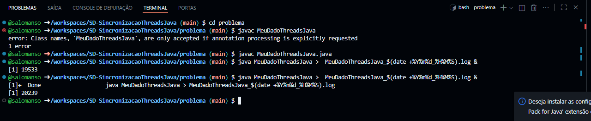
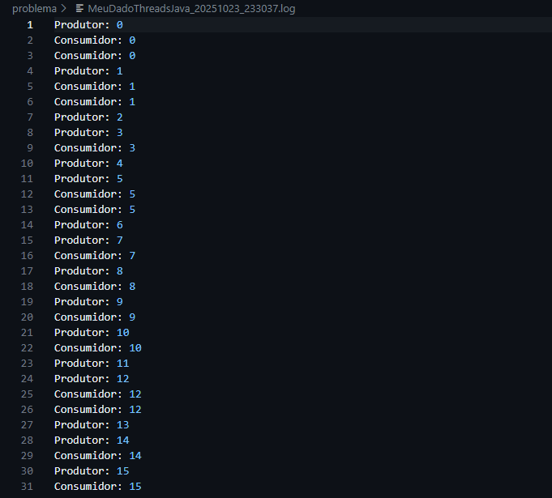
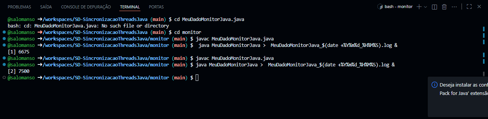
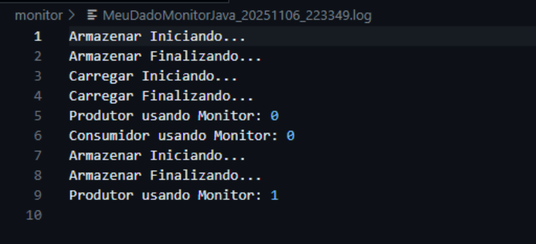
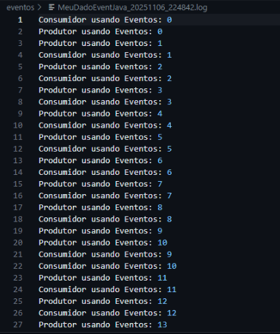

# Problemas

¡.

## Relatório/explicação

Após compilar e executar o arquivo (criando também uma log), ficou claro na mesma que no codigo existe uma race condition(condição de corrida).  

### Mas como funciona?

A race condition basicamente acontece quando duas ou mais threads acessam ou modificam o mesmo recurso, mas nesse caso sem qualquer sincronização.

No caso do nosso codigo, a race condition faz com que o **produtor** e o **consumidor** acessem simultaneamente uma mesma várialvel, provocando uma total  
dessincronização.

* Em minha opinião explicar essa condição é muito educativo, pois apesar de ela provavelmente poder ser usada para outras coisas(que não envolvem ordem nem atualizações),  
é uma condição que normalmente devemos nos atentar para **não** acontecer.

# Monitor

## Relatório/explicação

No caso do codigo do monitor, as coisas mudam um pouco de cenário..  
* É feito algo que podemos chamar de "gambiarra", que arruma não arruma 100% o problema de race condition, e também causa outro ainda pior conhecido como **busy waiting**. Colocamos essencialmente e literalmente um para esperar o outro, mas quando fazemos isso, o processador fica em **ativação contínua**, ou em outras palavras em um **loop infinito**.
* Devo Incluir que mesmo se feita essa "correção", a race condition não é totalmente tratada, já que as threads ainda não tem controle(agem individulamente, podendo indevidamen te ler um valor antigo ou não ver a atualização feita por outra thread).

### Qual foi a lógica aplicada?

* O codigo basicamente utilizada do **"ocupado"** e **"pronto""** para funcionar, e então faz de forma forçada com que o processador fique extramemente estressado,  
podendo assim fazer com que chegue a 100% de uso.

* Em minha opinião, nesse caso a correção que chamei de "gambiarra" não foi nada útil, e também, acabou piorando nosso problema. Fica claro que esse é um caso de programação ignorante(provalmente algo que fariamos caso não houvesse uma aula sobre).

# Eventos

## Relatório/explicação

* Aqui as coisas correm como esperado, mostrando o resultado de forma correta. Quando sincronizamos os métodos armazenar() e carregar() com **synchronized**, fazemos com que apenas uma thread possa acessar o objeto(MeuDadoEvent) por vez, ou seja, não haverá mais a race condition.

## E o que ocorre com o busy waiting?

* Nesse caso foi colocado o "wait" e o "notify", que corrige esse problema. Ele faz basicamente o produtor esperar(off/dormir) até o consumidor capturar o dado, quando feito, o consumidor espera o produtor produzir o dado(e claro, o notify notifica quando puderem "deixar de esperar").

